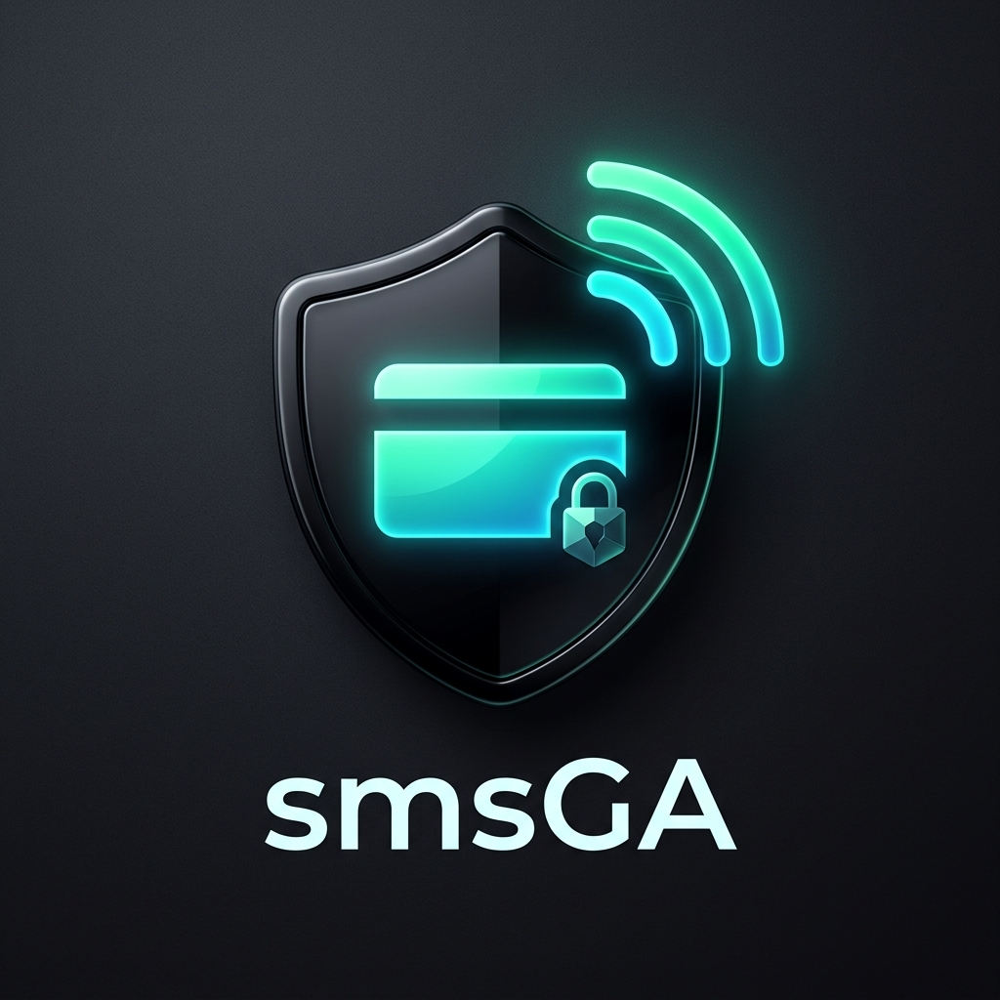
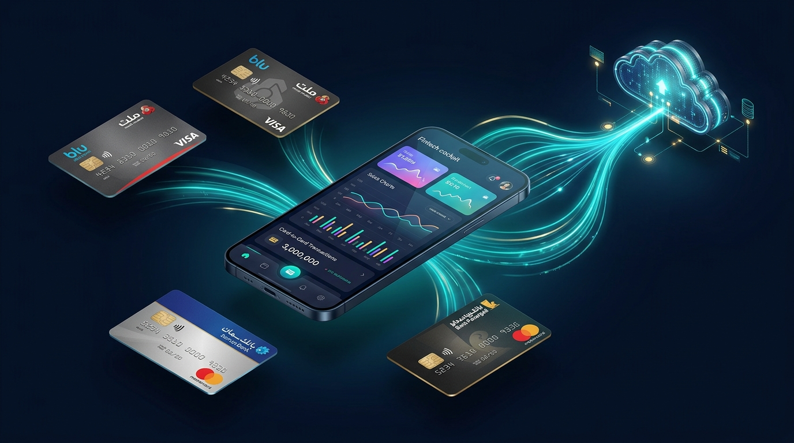
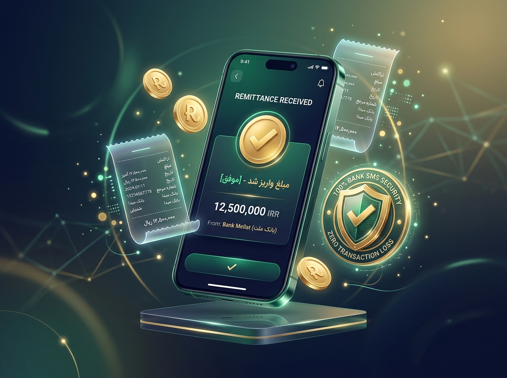

<div align="center">



# smsGAClient (اس‌ام‌اس جی‌ای)

### سامانه مدیریت کارت‌به‌کارت و بریج ارسال وب‌هوک پیامک‌های بانکی برای پذیرندگان ایرانی
**Production-Grade Android Card-to-Card Payment Cockpit & Background SMS Forwarding Bridge**

[](https://github.com/milibots/smsGAClient/releases/latest)
[-3DDC84?style=for-the-badge&logo=android&logoColor=white)](https://android.com)
[](https://kotlinlang.org)
[](https://m3.material.io)
[](LICENSE)

<br/>



</div>

---

## 📖 معرفی سامانه / Overview

**smsGAClient** یک اپلیکیشن بومی اندروید به زبان کاتلین است که گوشی پذیرنده یا فروشگاه را به یک **درگاه اختصاصی و پایانه هوشمند مدیریت پرداخت کارت‌به‌کارت** تبدیل می‌کند. 

این برنامه با دریافت پیامک‌های واریزی بانک‌های مختلف ایران، آن‌ها را به صورت کاملاً آفلاین و آنی تجزیه کرده و از طریق وب‌هوک امن با امضای دیجیتال `HMAC-SHA256` به سرور فروشگاه، ربات تلگرام یا سامانه شما ارسال می‌کند.

<div align="center">
  
</div>

---

## 🌟 ویژگی‌های کلیدی / Key Features

### ۱. موتور بریج پس‌زمینه بدون قطعی (The Bridge)
- **Zero SMS Loss Architecture**: ذخیره بیدرنگ در دیتابیس محلی Room با اولویت بالای گیرنده (`priority = 999`) قبل از هرگونه تلاش شبکه.
- **معافیت خودکار از بهینه‌سازی باتری (Doze Mode Bypass)**: درخواست مستقیم مجوز فعالیت بدون محدودیت جهت جلوگیری از توقف برنامه در زمان قفل بودن صفحه.
- **راهنمای شروع خودکار اختصاصی (OEM AutoStart)**: پشتیبانی و انتقال خودکار به تنظیمات گوشی‌های شیائومی (MIUI / HyperOS Autostart)، سامسونگ، هواوی، اوپو و ویوو.
- **امضای امنیتی HMAC-SHA256**: تمام بسته‌های ارسالی به وب‌هوک دارای امضای رمزنگاری‌شده بر پایه کلید مخفی پذیرنده هستند.
- **صف آفلاین و تلاش مجدد هوشمند**: ذخیره پیامک‌ها در صورت قطع اینترنت و ارسال متوالی آن‌ها به محض بازگشت شبکه با الگوریتم Exponential Backoff.

### ۲. داشبورد و کاک‌پیت پذیرنده (The Cockpit)
- **تایپوگرافی اصیل با فونت وزیرمتن (Vazirmatn)**: در ۵ وزن استاندارد جهت نمایش بی‌نقص و بدون بریدگی اعداد فارسی، مبالغ و حروف خاص (گ، ژ، پ، چ، ی).
- **باتم‌شیت‌های روان متریال ۳ (Modal Bottom Sheets)**: فرم‌های مدرن افزودن کارت، لغو اتصال و راه‌اندازی پس‌زمینه با گوشه‌های ۳۲dp و دستگیره لمسی.
- **پایش سقف تراکنش کارت‌ها و چرخش خودکار**: نمایش هوشمند پر شدن سقف روزانه واریز کارت‌ها (۱ میلیارد ریال) همراه با هشدار رنگی زرد (۹۰٪) و قرمز (۱۰۰٪).
- **رسید دیجیتال بانکی**: نمایش تراکنش‌ها در قالب رسید حرارتی خوانا با قابلیت کپی سریع شماره پیگیری و شماره کارت.
- **گاوصندوق سخت‌افزاری**: ذخیره امن آدرس وب‌هوک و کلیدهای ارتباطی با رمزنگاری `AES256-GCM` متصل به Android Keystore.

---

## 📶 الزامات اتصال به اینترنت و رفتار آفلاین / Connectivity & Offline Queue

> ⚠️ **نکته بسیار مهم برای پذیرندگان و کسب‌وکارها:**
> جهت **تأیید آنی و خودکار پرداخت مشتریان (زیر ۳ الی ۵ ثانیه)** در وب‌سایت یا ربات، گوشی پذیرنده **باید همواره به اینترنت (دیتای سیم‌کارت یا وای‌فای) متصل باشد**.

### ۱. آیا گوشی همیشه باید آنلاین باشد؟
- **برای دریافت پیامک بانک:** خیر! پیامک‌ها بر بستر شبکه مخابراتی سیم‌کارت دریافت می‌شوند؛ بنابراین حتی اگر اینترنت گوشی کاملاً قطع باشد یا در حالت پرواز موقت، به محض وصل شدن آنتن پیامک دریافت و در دیتابیس محلی ذخیره می‌شود.
- **برای ارسال وب‌هوک و تأیید آنی سفارش مشتری:** **بله**. برای اینکه درگاه شما به صورت بلادرنگ به مشتری رسید پرداخت نشان دهد و وضعیت فاکتور را «پرداخت شده» کند، اپلیکیشن نیاز به اینترنت فعال دارد تا وب‌هوک را به سرور شما شلیک کند.

### ۲. اگر اینترنت گوشی موقتاً قطع شود چه اتفاقی می‌افتد؟ (Zero Data Loss)
- **هیچ تراکنشی از بین نمی‌رود!** تمام پیامک‌ها بلافاصله در دیتابیس داخلی گوشی (`Room SQLite`) ذخیره و در صف با وضعیت `در صف ارسال (PARSED)` قرار می‌گیرند.
- به محض اینکه اتصال اینترنت مجدداً برقرار شود، سامانه مدیریت پس‌زمینه (`WorkManager`) به صورت خودکار بیدار شده و تمام تراکنش‌های صف را به ترتیب به سرور وب‌هوک ارسال می‌کند.
- در داشبورد اپلیکیشن نیز در بخش وضعیت، تعداد پیامک‌های «در صف ارسال» به صورت شفاف و زنده نمایش داده می‌شود.

### ۳. بهترین پیکربندی پیشنهادی برای فروشگاه‌ها (Best Practices):
1. **گوشی اختصاصی (POS Phone):** یک گوشی اندرویدی مجزا (حتی ارزان‌قیمت با اندروید ۷+) را به عنوان سرور پرداخت اختصاص دهید که سیم‌کارت‌های متصل به حساب بانکی روی آن قرار داشته باشد.
2. **اتصال دائم به برق و اینترنت:** گوشی همواره متصل به شارژر و اینترنت وای‌فای یا دیتای سیم‌کارت پایدار باشد.
3. **رفع محدودیت باتری (Unrestricted Battery):** هنگام اولین اجرای برنامه، مجوز معافیت از بهینه‌سازی باتری (`Doze Mode`) را تایید کنید تا سیستم‌عامل اندروید در حالت خاموش بودن صفحه، سرویس پیامک را متوقف نکند.

---

## 💻 راهنمای توسعه‌دهندگان و اتصال به وب‌هوک (Developer Guide)

اگر مدیر فنی یا برنامه‌نویس هستید، می‌توانید با استفاده از فریم‌ورک‌های مدرن نظیر **FastAPI (Python)** وب‌هوک‌های ارسالی از گوشی را دریافت، اعتبارسنجی و سفارش‌های مشتریان را خودکار تایید کنید.

### گردش‌کار سیستم (End-to-End Payment Flow)

```
[مشتری در سایت / ربات تلگرام]
      │ ۱. درخواست خرید (مبلغ پایه: ۵۰٬۰۰۰ تومان)
      ▼
[سرور شما (FastAPI)] ────── اختصاص کارت فعال و مبلغ یکتا (مثلاً ۵۰٬۰۳۴ تومان)
      │
      ▼
[مشتری کارت‌به‌کارت می‌کند]
      │
      ▼
[بانک (ملت، بلو، صادرات و...)]
      │ ارسال پیامک واریز به گوشی فروشنده
      ▼
[اپلیکیشن smsGAClient (روی گوشی)]
      │ ۲. دریافت آنی + استخراج مبلغ، ۴ رقم آخر کارت، نام بانک
      │ ۳. امضای امنیتی هدر با کلید سری HMAC-SHA256
      │ ۴. ارسال وب‌هوک POST به سرور شما
      ▼
[وب‌هوک سرور شما]
      │ ۵. تایید امضای HMAC + بررسی عدم تکراری بودن (Idempotency)
      │ ۶. انطباق تراکنش با سفارش مشتری (بر اساس مبلغ و زمان)
      │ ۷. تغییر وضعیت سفارش به «پرداخت شده» و تحویل سفارش
```

### مشخصات درخواست وب‌هوک (Webhook Contract)

- **Method**: `POST`
- **URL**: آدرس HTTPS اختصاصی شما (مثلاً `https://api.yourshop.ir/webhook/sms-deposit`)
- **Headers**:
  ```http
  Content-Type: application/json
  Authorization: Bearer <api_token>
  X-SmsGA-Signature: hmac-sha256=<hex_digest>
  X-SmsGA-Device: <device_uuid>
  X-SmsGA-Timestamp: <unix_seconds>
  User-Agent: smsGAClient/1.0.3 (Android <sdk>)
  ```

- **فرمول امضا**:
  ```text
  signature = HMAC_SHA256(hmac_secret, "<timestamp>.<raw_body_bytes>")
  ```

- **نمونه بدنه داده ارسالی (JSON Payload)**:
  ```json
  {
    "event": "sms.deposit",
    "message_id": "sha256:abc123456789...",
    "device_id": "a1b2c3d4-e5f6-4a1b-8c2d-1234567890ab",
    "merchant_id": "m_8821",
    "received_at": "2026-09-21T14:32:11+03:30",
    "bank": "blu",
    "type": "deposit",
    "amount_rial": 4500280,
    "amount_toman": 450028,
    "card_last4": "1234",
    "balance_rial": 125000000,
    "raw_sms": "+۴٬۵۰۰٬۲۸۰ ریال — بلو",
    "parse_version": 41
  }
  ```

### نمونه پیاده‌سازی سرور وب‌هوک با FastAPI

```python
import hmac
import hashlib
import time
from typing import Optional
from fastapi import FastAPI, Header, HTTPException, Request, status, Depends
from pydantic import BaseModel

app = FastAPI(title="smsGA Webhook Receiver")

MERCHANT_CONFIG = {
    "api_token": "smsga_token_secret_123456",
    "hmac_secret": "smsga_hmac_secret_abcdef"
}

PROCESSED_MESSAGES = set()

class SmsPayload(BaseModel):
    event: str
    message_id: str
    device_id: str
    bank: str
    type: str
    amount_toman: Optional[int] = None
    card_last4: Optional[str] = None
    raw_sms: str

async def verify_smsga_signature(
    request: Request,
    authorization: Optional[str] = Header(None),
    x_smsga_signature: Optional[str] = Header(None),
    x_smsga_timestamp: Optional[int] = Header(None)
):
    # ۱. اعتبارسنجی Bearer Token
    if not authorization or authorization != f"Bearer {MERCHANT_CONFIG['api_token']}":
        raise HTTPException(status_code=status.HTTP_401_UNAUTHORIZED, detail="Invalid token")

    # ۲. جلوگیری از Replay Attack (اختلاف زمان کمتر از ۵ دقیقه)
    if not x_smsga_timestamp or abs(time.time() - x_smsga_timestamp) > 300:
        raise HTTPException(status_code=status.HTTP_400_BAD_REQUEST, detail="Timestamp expired")

    # ۳. تایید امضای HMAC-SHA256
    raw_body = await request.body()
    payload_to_sign = f"{x_smsga_timestamp}.".encode("utf-8") + raw_body
    expected_sig = hmac.new(
        MERCHANT_CONFIG["hmac_secret"].encode("utf-8"),
        payload_to_sign,
        hashlib.sha256
    ).hexdigest()

    client_sig = (x_smsga_signature or "").replace("hmac-sha256=", "").strip()
    if not hmac.compare_digest(expected_sig, client_sig):
        raise HTTPException(status_code=status.HTTP_401_UNAUTHORIZED, detail="Signature mismatch")

@app.post("/webhook/sms-deposit")
async def receive_sms(payload: SmsPayload, _auth=Depends(verify_smsga_signature)):
    # تایید تست اتصال در اپلیکیشن
    if payload.event == "test":
        return {"status": "ok", "message": "Connection test verified successfully"}

    # پیشگیری از دوبار پردازش پیامک (Idempotency)
    if payload.message_id in PROCESSED_MESSAGES:
        return {"status": "duplicate", "message": "Already processed"}

    if payload.type == "deposit" and payload.amount_toman:
        # جستجو در سفارش‌های معلق بر اساس مبلغ و ۴ رقم کارت
        PROCESSED_MESSAGES.add(payload.message_id)
        # TODO: علامت‌گذاری فاکتور به عنوان پرداخت شده در دیتابیس
        return {"status": "success", "amount_toman": payload.amount_toman}

    return {"status": "ignored"}
```

---

## 🏦 بانک‌های تحت پوشش / Supported Banks

الگوهای پیامکی به صورت مجزا در دایرکتوری [`banks/`](banks/) نگهداری می‌شوند:

| بانک | نماد | پشتیبانی واریز / برداشت | استخراج مانده و پیگیری | فایل الگو |
| :--- | :---: | :---: | :---: | :---: |
| **بلوبانک (Blu Bank)** | 🔵 | ✅ | ✅ | [`banks/blu.json`](banks/blu.json) |
| **بانک سامان (Saman)** | 🔷 | ✅ | ✅ | [`banks/saman.json`](banks/saman.json) |
| **بانک پاسارگاد (Pasargad)** | 🟡 | ✅ | ✅ | [`banks/pasargad.json`](banks/pasargad.json) |
| **بانک ملت (Mellat)** | 🔴 | ✅ | ✅ | [`banks/mellat.json`](banks/mellat.json) |
| **بانک سپه (Sepah)** | ⚪ | ✅ | ✅ | [`banks/sepah.json`](banks/sepah.json) |
| **بانک ملی ایران (Melli)** | 🟢 | ✅ | ✅ | [`banks/melli.json`](banks/melli.json) |
| **بانک تجارت (Tejarat)** | 🔵 | ✅ | ✅ | [`banks/tejarat.json`](banks/tejarat.json) |
| **بانک پارسیان (Parsian)** | 🟤 | ✅ | ✅ | [`banks/parsian.json`](banks/parsian.json) |
| **بانک صادرات (Saderat)** | 🔵 | ✅ | ✅ | [`banks/saderat.json`](banks/saderat.json) |
| **بانک شهر (Shahr)** | 🔴 | ✅ | ✅ | [`banks/shahr.json`](banks/shahr.json) |
| **بانک آینده (Ayandeh)** | 🟤 | ✅ | ✅ | [`banks/ayandeh.json`](banks/ayandeh.json) |
| **بانک کشاورزی (Keshavarzi)** | 🟢 | ✅ | ✅ | [`banks/keshavarzi.json`](banks/keshavarzi.json) |
| **بانک رفاه کارگران (Refah)** | 🔵 | ✅ | ✅ | [`banks/refah.json`](banks/refah.json) |
| **بانک رسالت (Resalat)** | 🟡 | ✅ | ✅ | [`banks/resalat.json`](banks/resalat.json) |
| **پست بانک ایران (Post Bank)** | 🟢 | ✅ | ✅ | [`banks/postbank.json`](banks/postbank.json) |

> 🤝 **مشارکت همگانی و افزودن بانک جدید**:
> برای ثبت یا تصحیح فرمت پیامک هر بانک کافیست فایل JSON مربوطه را ویرایش یا اضافه کرده و **Pull Request** دهید. توضیحات کامل در [راهنمای الگوها (`banks/README.md`)](banks/README.md).

---

## 📦 دانلود نسخه‌های نصبی / Download APKs (v1.0.3)

تمامی فایل‌های نصبی زیر امضا شده با گواهی تولید، دارای بهینه‌سازی کامل R8 و فونت‌های فارسی بومی هستند:

| نوع پردازنده / معماری | فایل نصبی | حجم | لینک دانلود مستقیم |
| :--- | :--- | :---: | :---: |
| **ARM 64-bit (اکثر گوشی‌های مدرن)** | `app-prod-arm64-v8a-release.apk` | **1.99 MB** | [دانلود نسخه ARM64](https://github.com/milibots/smsGAClient/releases/latest/download/app-prod-arm64-v8a-release.apk) |
| **ARM 32-bit (گوشی‌های قدیمی و پوز)** | `app-prod-armeabi-v7a-release.apk` | **1.99 MB** | [دانلود نسخه ARMv7a](https://github.com/milibots/smsGAClient/releases/latest/download/app-prod-armeabi-v7a-release.apk) |
| **یونیورسال (همه‌کاره برای تمامی گوشی‌ها)** | `app-prod-universal-release.apk` | **2.05 MB** | [دانلود نسخه یونیورسال](https://github.com/milibots/smsGAClient/releases/latest/download/app-prod-universal-release.apk) |
| **x86_64 (شبیه‌ساز کامپیوتر ۶۴ بیتی)** | `app-prod-x86_64-release.apk` | **2.00 MB** | [دانلود نسخه x86_64](https://github.com/milibots/smsGAClient/releases/latest/download/app-prod-x86_64-release.apk) |
| **x86 (شبیه‌ساز ۳۲ بیتی)** | `app-prod-x86-release.apk` | **1.99 MB** | [دانلود نسخه x86](https://github.com/milibots/smsGAClient/releases/latest/download/app-prod-x86-release.apk) |

---

## 🔒 امنیت و حریم خصوصی / Security & Privacy
- 🚫 **فاقد ابزارهای ردیابی و تبلیغات**: بدون Firebase، Analytics یا ابزارهای مانیتورینگ خارجی.
- 🚫 **عدم دسترسی به ارسال پیامک**: برنامه تنها مجوز خواندن پیامک (`RECEIVE_SMS` و `READ_SMS`) دارد و فاقد هرگونه مجوز ارسال است.
- 🔐 **پایگاه داده رمزنگاری شده آفلاین**: کلیه اطلاعات و تراکنش‌ها فقط در حافظه رم و پایگاه داده دستگاه شما باقی می‌ماند.

---

## 🛠️ ساخت از سورس‌کد / Build from Source

```bash
# کلون کردن مخزن
git clone https://github.com/milibots/smsGAClient.git
cd smsGAClient

# اجرای تمامی تست‌های خودکار
./gradlew test

# ساخت پکیج‌های نهایی پروداکشن
./gradlew assembleProdRelease
```

---

## 📄 مستندات تکمیلی / Documentation
- [نمای کلی سیستم (`docs/00_OVERVIEW.md`)](docs/00_OVERVIEW.md)
- [قرارداد وب‌هوک و API (`docs/API_CONTRACT.md`)](docs/API_CONTRACT.md)
- [تاریخچه تغییرات (`docs/CHANGELOG.md`)](docs/CHANGELOG.md)
- [یادداشت‌های انتشار نسخه ۱.۰.۳ (`docs/RELEASE_NOTES_v1.0.3.md`)](docs/RELEASE_NOTES_v1.0.3.md)
